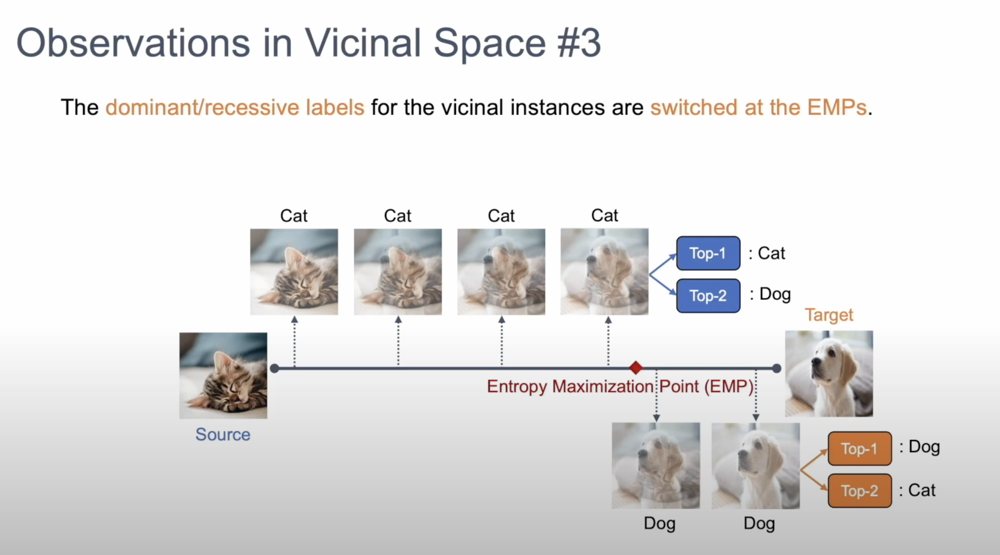

<div align="center">

## CoVi: Contrastive Vicinal Space for Unsupervised Domain Adaptation
  
[](https://arxiv.org/pdf/2111.13353.pdf)
[](https://arxiv.org/pdf/2111.13353.pdf)
</div>

> **Contrastive Vicinal Space for Unsupervised Domain Adaptation**<br>
> [Jaemin Na](https://github.com/NaJaeMin92), Dongyoon Han, Hyung Jin Chang, Wonjun Hwang<br>
> In ECCV 2022.<br><br/>

<div align=center></div><br/>

<!-- [YouTube](https://www.youtube.com/watchwatch?v=o0jEox4z3OI)<br> -->
> **Abstract:** *Recent unsupervised domain adaptation methods have utilized vicinal space between the source and target domains. However, the equilibrium collapse of labels, a problem where the source labels are dom- inant over the target labels in the predictions of vicinal instances, has never been addressed. In this paper, we propose an instance-wise minimax strategy that minimizes the entropy of high uncertainty instances in the vicinal space to tackle the stated problem. We divide the vicinal space into two subspaces through the solution of the minimax prob- lem: contrastive space and consensus space. In the contrastive space, inter-domain discrepancy is mitigated by constraining instances to have contrastive views and labels, and the consensus space reduces the confusion between intra
domain categories. The effectiveness of our method is demonstrated on public benchmarks, including Office-31, Office-Home, and VisDA-C, achieving state-of-the-art performances. We further show that our method outperforms the current state-of-the-art methods on PACS, which indicates that our instance-wise approach works well for multi-source domain adaptation as well.*

## Introduction

> **Video:** Click the figure to watch the explanation video.

[](https://youtu.be/o0jEox4z3OI)

## Requirements
- Linux
- Python >= 3.7
- PyTorch == 1.7.1 
- CUDA (must be a version supported by the pytorch version)

## Getting Started

#### Training process.
Below we provide an example for training a CoVi on Office-31.
```bash
python main.py \
-gpu 0
-source amazon \
-target dslr \
-db_path $DATASET_PATH \
-baseline_path $BASELINE_PATH
```
- `$DATASET_PATH` denotes the location where datasets are installed.
- `$BASELINE_PATH` requires the path where pretrained models (DANN, MSTN, etc.) are stored.
- For DANN, the following code may be used: [pytorch-DANN](https://github.com/NaJaeMin92/pytorch_DANN)

## Contact
For questions, please contact: osial46@ajou.ac.kr

## Citation
If you use this code in your research, please cite:
```bibtex  
@article{na2021contrastive,
  title={Contrastive Vicinal Space for Unsupervised Domain Adaptation},
  author={Na, Jaemin and Han, Dongyoon and Chang, Hyung Jin and Hwang, Wonjun},
  journal={arXiv preprint arXiv:2111.13353},
  year={2021}
}
```
